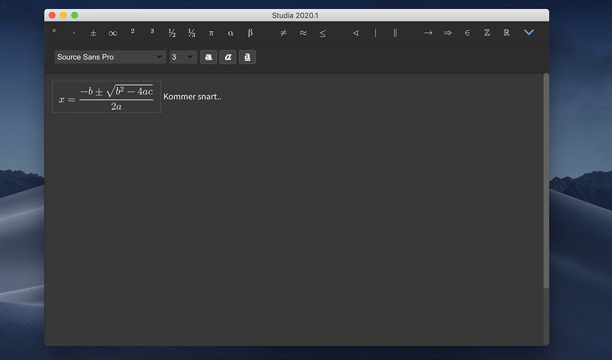

# Studia Math

## What's this?

The goal of this is to have a usable LaTeX editor, using [Quill](http://quilljs.com/) and [MathQuill](http://mathquill.com/).

## Information

### Main Dependencies

This code depends on [MathQuill](http://docs.mathquill.com/en/latest/Getting_Started/), [Quill](https://quilljs.com/docs/quickstart/) and [KaTeX](https://github.com/Khan/KaTeX#usage).

### Planned

Functions yet to be implemented are noted here:

- macOS dark/light mode.
- Optimization